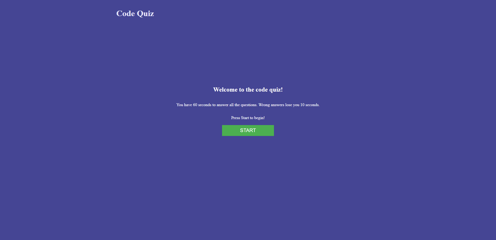
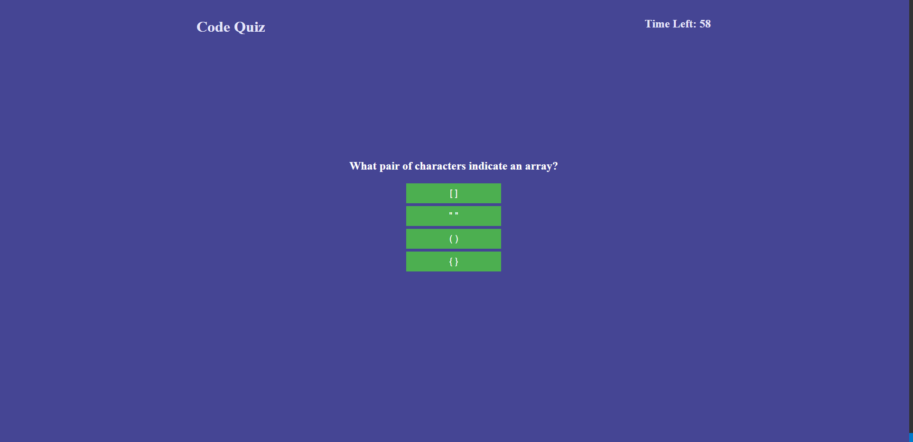
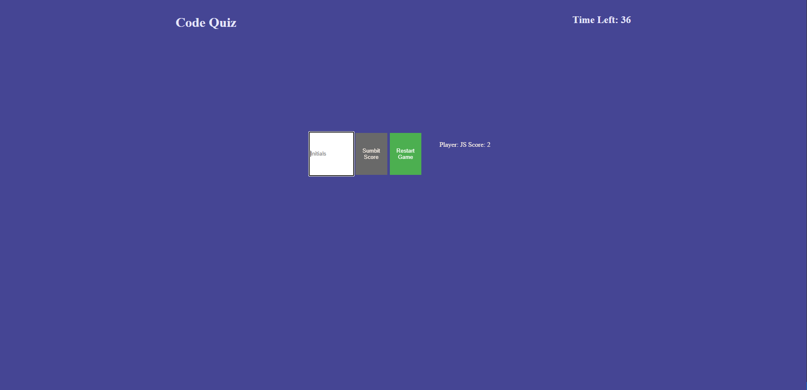
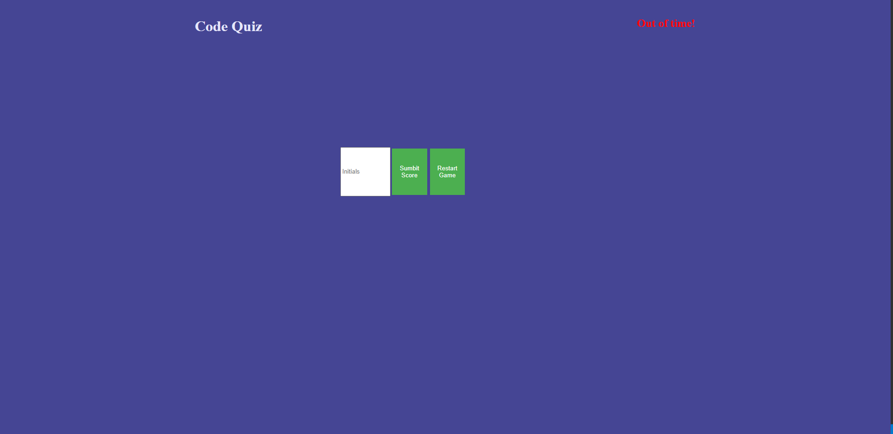

# Challenge-4
Bootcamp Challenge-4 Code Quiz

## Description
* Simple quiz game to test some basic knowledge
* User has 60 seconds to complete the quiz
* Wrong answers reduce the time by 10 seconds
* If the timer hits 0 the results page is dispayed
* User can enter their initials to save their score
* Submit button is disabled after user inputs their score but is enabled again if they play again.

## Links
* Github: https://github.com/IRiceKrispie/challenge-4
* Pages: 

## Screenshots
Start Page

Screenshot of a question

Results Page

User Runs out of time
